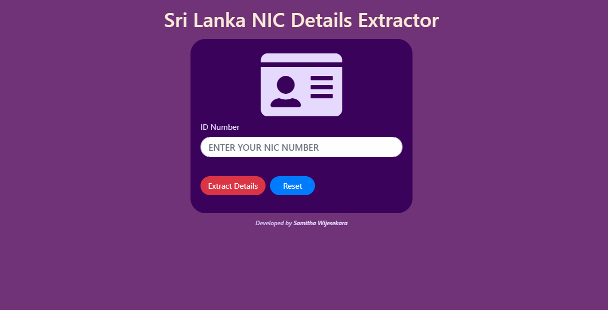
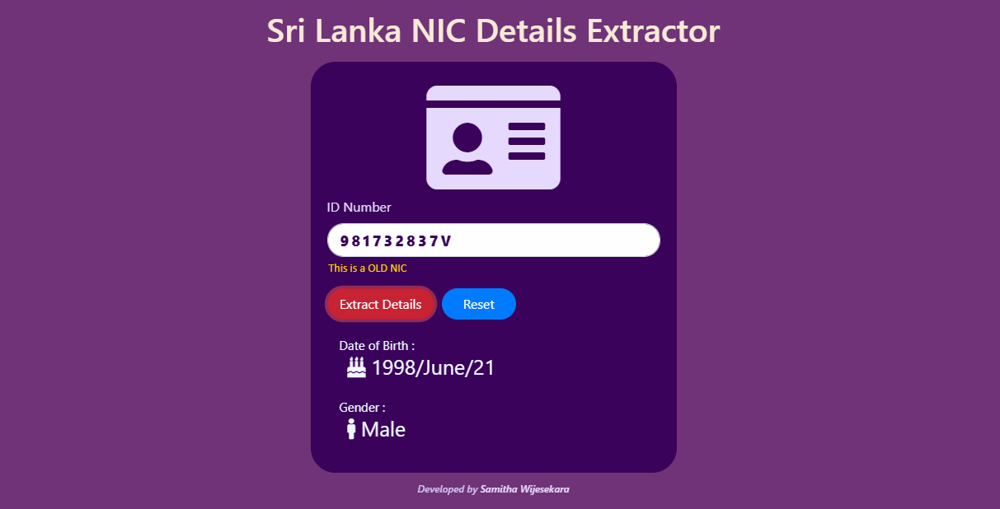
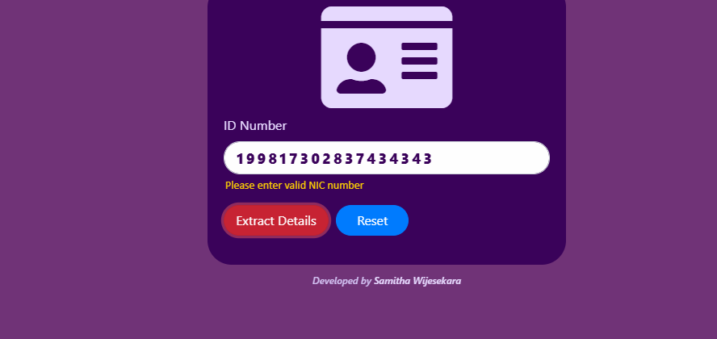

# Sri Lanka NIC Details Extractor
Extract details from Sri Lankan National ID card number

💻😍 You can use this link to send me a message : https://sri-lanka-nic-details-extractor.netlify.app/

### Table of Content
-01 [What is this?](#What) 
-02 [For why?](#why) 
-03 [What are the technologies used?](#technologies) 
-04 [How to used this?](#How) 

## What is this?<a name="What"/>
This is a tool for check your National Identity Card & extract details from it. 

## For why?<a name="why"/>
If we want to know someone's Birthday & Gender by using his/her NIC number we can use this tool. 

## What are the technologies used?<a name="technologies"/>
- HTML
- CSS
- JavaScript
- Bootstrap

## How to use this?<a name="How"/>

Just type the NIC number in the given text field & click the **Extract Details** button. If you need to reset the text field or reload the page click the **Reset** button.  
  

If you enter an OLD NIC number you will get the **This is an OLD NIC** label. OLD NIC number should contain **9 numeric** characters & one single alphabet letter **v** or **V**. 
Example :- **981732837V** or **981732837v**
  
  

If you enter a NEW NIC number you will get the **This is a NEW NIC** label. The NEW NIC number should contain **12 numeric** characters only. 
Example :- **199817302837** or **199817302837**
  
  

If you enter an invalid NIC number to the text field you will get the error **"Please enter valid NIC number"**.  
  

